# Extension Sets Manager

Save named sets of enabled and disabled extensions, switch between them from the Extensions page, and optionally keep each Set's savegames apart from the rest.

## Overview

X4 keeps exactly one list of enabled extensions. Playing a heavily modded game and a light one, or keeping a stable setup beside a test setup, means toggling extensions by hand every time and remembering which of the sixty entries in the list were on.

This mod adds its own block at the top of **Options > Extensions**: capture the current setup under a name, keep as many of those Sets as you like, and switch between them with one drop-down and one button. Extension changes need a full restart in any case, so applying a Set offers to exit to desktop right away.

A Set can also own its savegames. With that turned on, everything saved while the Set is active is stored under an id of its own and only that Set sees it, so a save made in the modded setup cannot be loaded into the light one by accident. The save and load pages, and the Continue entry in the main menu, say which Set each save belongs to.

The whole feature is off on a fresh install. Nothing changes until you switch it on, and switching it off again leaves every Set, every setting and every savegame where it was.

## Requirements

- **X4: Foundations**: version **8.00** or higher.
- **UI Extensions and HUD** by [kuertee](https://next.nexusmods.com/profile/kuertee?gameId=2659): version **v8.0.4.x** or higher on game 8.00, version **v9.0.0.4** or higher on game 9.00.
  - Available on Nexus Mods: [UI Extensions and HUD](https://www.nexusmods.com/x4foundations/mods/552)
- **Print Extension List**: version **1.00** or higher by [Chem O`Dun](https://next.nexusmods.com/profile/ChemODun/mods?gameId=2659):
  - Available on Steam Workshop: [Print Extension List](https://steamcommunity.com/sharedfiles/filedetails/?id=3770927339)
  - Available on Nexus Mods: [Print Extension List](https://www.nexusmods.com/x4foundations/mods/2191)

## Installation

- **Steam Workshop**: link to be added on publication.
- **Nexus Mods**: link to be added on publication.

## How to use it

### Switching the feature on

Open **Options > Extensions**. The mod's block sits above the extension list, with a **...** button on its title row.

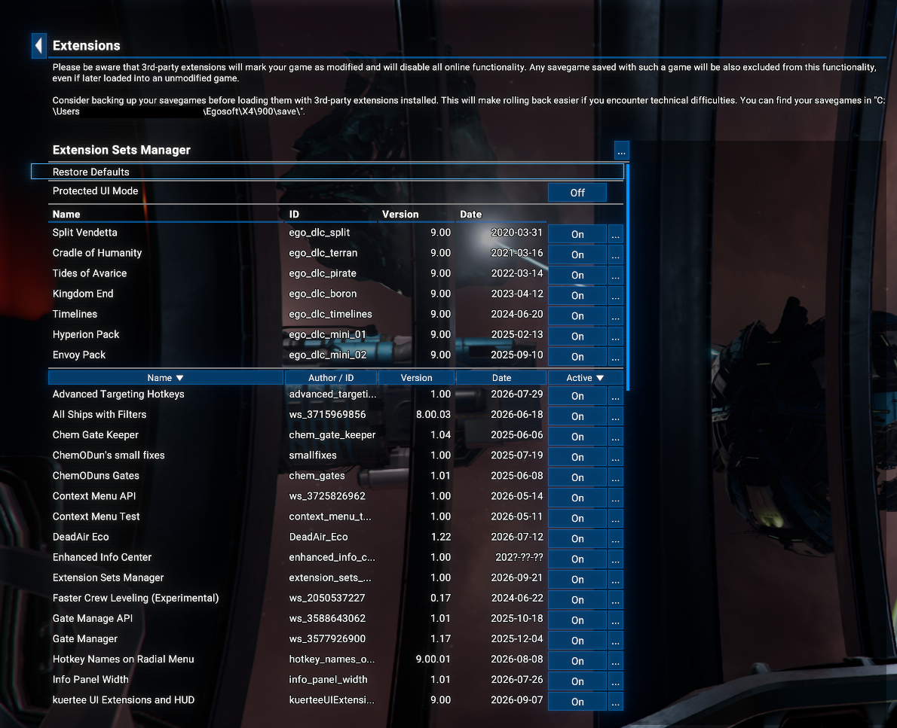

Press that button to open the mod's settings page and tick **Enabled**. The back arrow returns to the extension list, where the block has opened up.

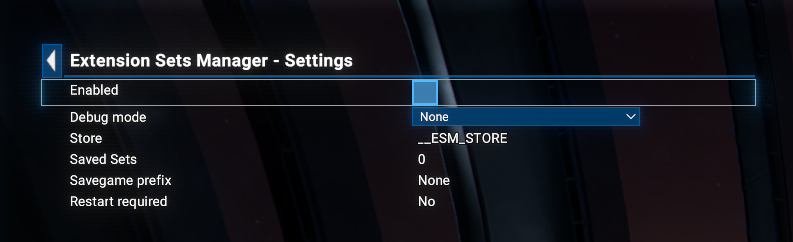

The first time it is switched on, the setup you are already running is captured as a Set called **Default**, and that Set becomes the active one. Your extensions themselves are left exactly as they are.

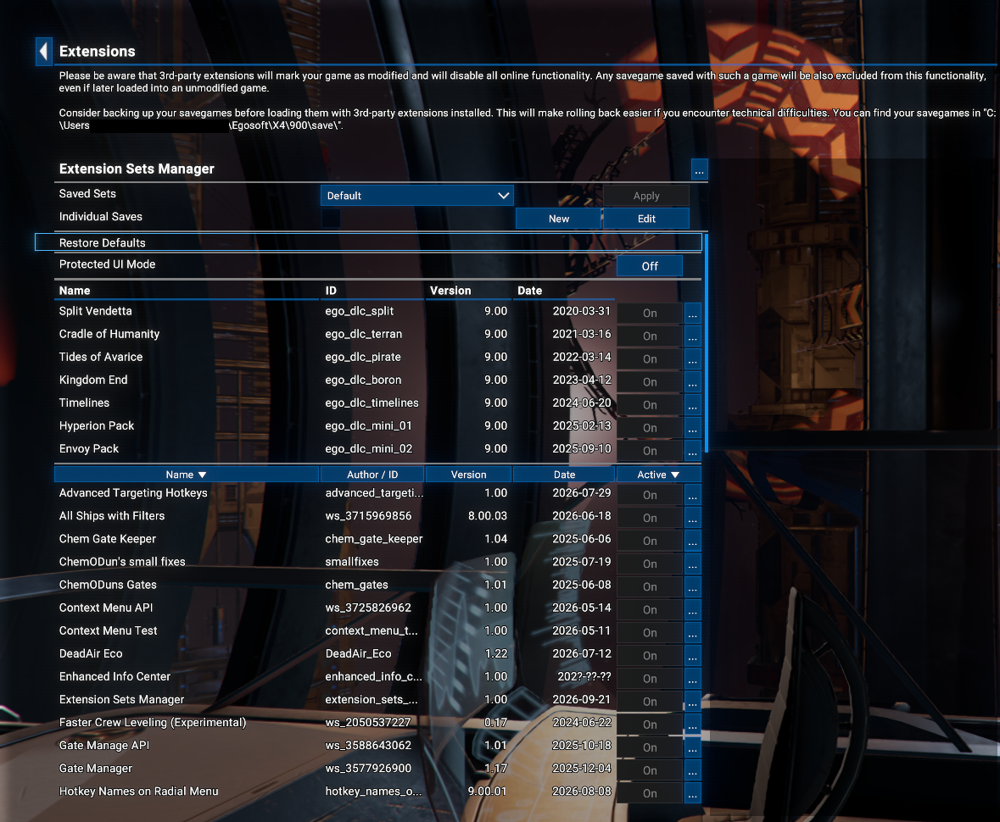

While the feature is on, the extension list below is read-only: the Enabled and Disabled buttons are greyed out, and the way to change an extension state is to edit a Set. Untick **Enabled** on the settings page and the list is yours again.

### Creating a Set

Press **New**, type a name, and set the extensions in the list below to whatever that Set should hold. Press **Save** to store it, or **Cancel** to drop the edit and put the extension states back as they were.

A Set name can be up to 30 characters and has to be unique.

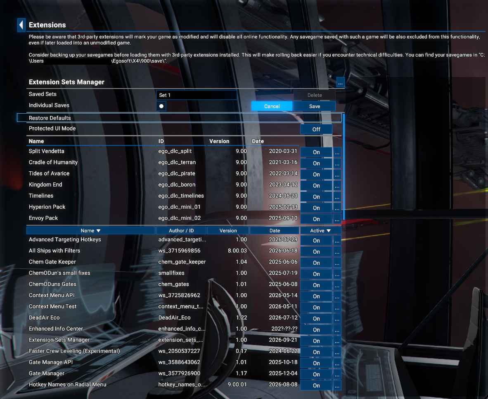

### Applying a Set

Pick a Set in the drop-down and the extension list below immediately shows what that Set holds, so you can look it over before committing to it. Nothing is recorded yet.

Selecting a Set is not enough: **Apply** is what makes it the active one.

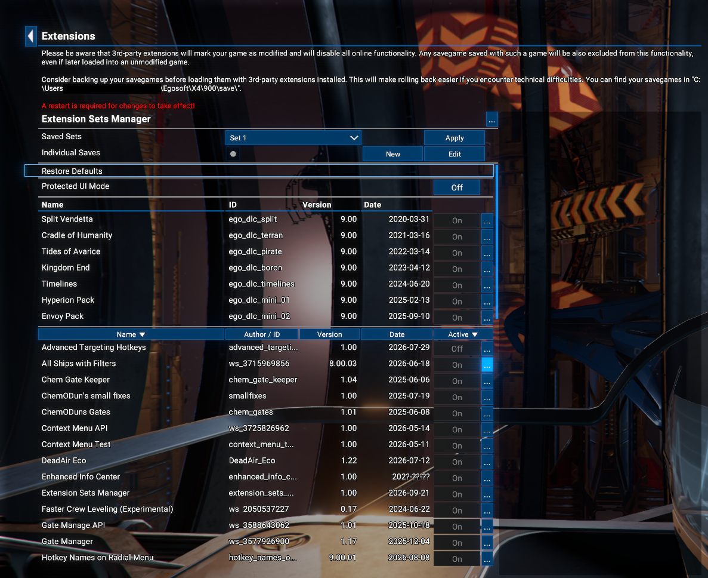

Leaving the Extensions page while the extension states differ from the applied Set brings up a prompt: switch back to the applied Set and leave, or return to the extension list. Moving to another screen by hotkey or through the top menu while in game skips the prompt and reverts to the applied Set.

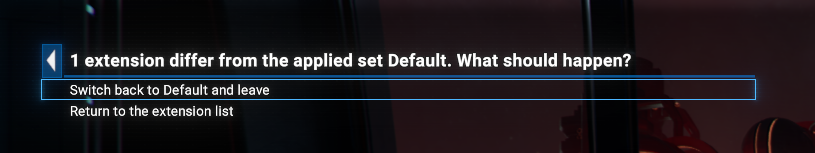

Because extension changes only take effect on a restart, pressing Apply offers to exit to desktop.

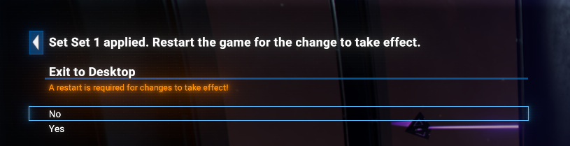

Answer **Yes** and the game closes. Start X4 again and the Set is running. Answer **No** and the Set is still recorded as applied, but the restart warning stays up until you do restart.

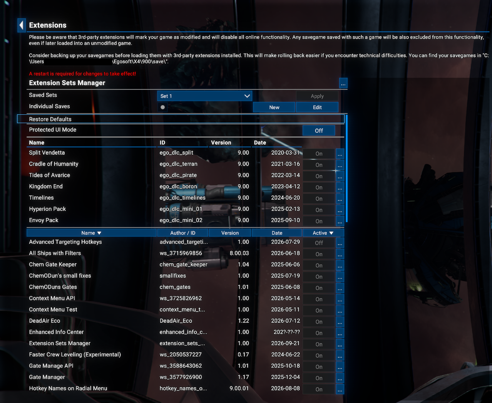

If the extension states already match the ones the game started with, Apply records the Set as applied and nothing else happens, so no exit is offered.

### Editing a Set

Pick the Set, press **Edit**, and the name becomes an edit box while the extension list becomes editable again. **Save** stores the name and the extension states together, so editing is both how a Set is renamed and how it is re-captured from the current list. **Cancel** drops everything and puts the extension states back.

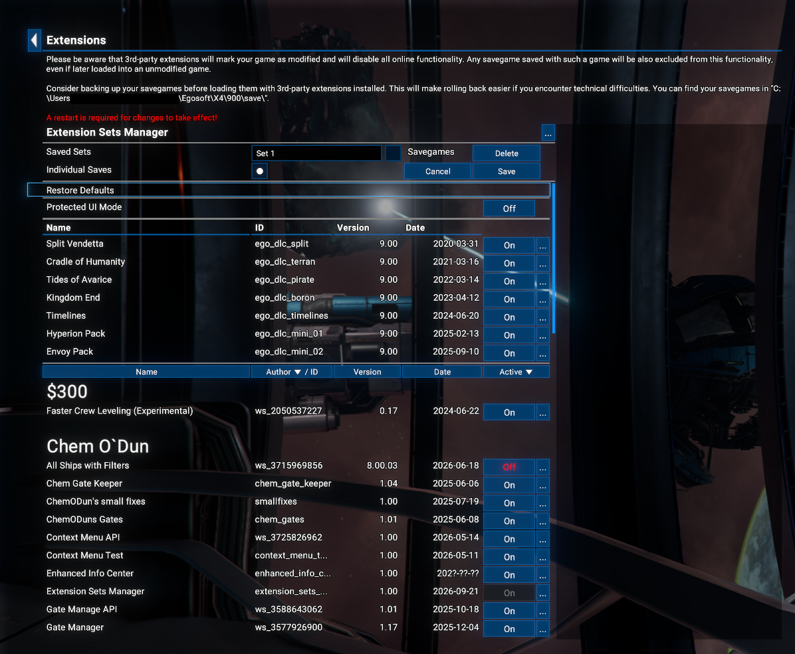

Leaving the page with an edit unfinished is refused outright. Pressing Esc or stepping back to the previous menu brings up a prompt with a single answer, **Return to editing**. Moving to another screen by hotkey or through the top menu while in game is not refused, and the edit is lost.

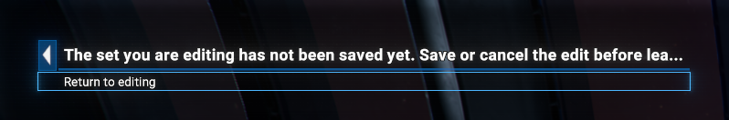

Unticking **Individual Saves** on a Set that already owns savegames raises its own prompt when you press Save, with three answers: save and delete those savegames, save and keep them, or return to editing.

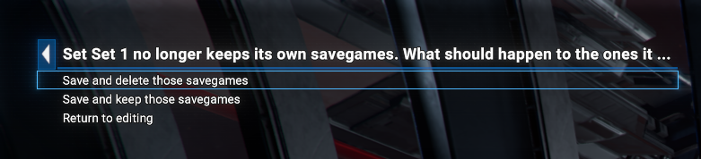

### Deleting a Set

Press **Edit** on the Set, then **Delete**. The extensions themselves are not touched. If the Set owns savegames, a checkbox appears beside the button to delete those along with it. Leave it unticked and the savegames stay on disk, but nothing in the game will list them again, because a Set id is never reused.

The **Default** Set cannot be deleted.

### Individual savegames

Every Set except **Default** carries an **Individual Saves** checkbox, which can be changed while the Set is being created or edited. With it on, saves written while that Set is active carry the Set's own five-digit id and are listed only under that Set. With it off, the Set uses the common pool of savegames, along with every other Set that does.

The **Default** Set always uses the common pool, which is what makes it the way back to an unmodified save list.

Quicksaves and autosaves are written by the game itself and stay shared across every Set.

### Working with savegames

Wherever savegames are listed, the page title says which Set you are in, and each entry says which Set it belongs to.

#### A Set that uses the common pool

With the feature on and the active Set not keeping its own savegames, every save you already had is there, and each one is marked **Shared**.

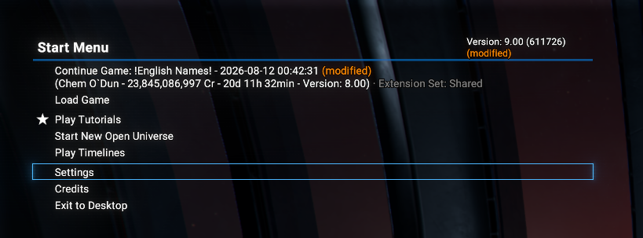

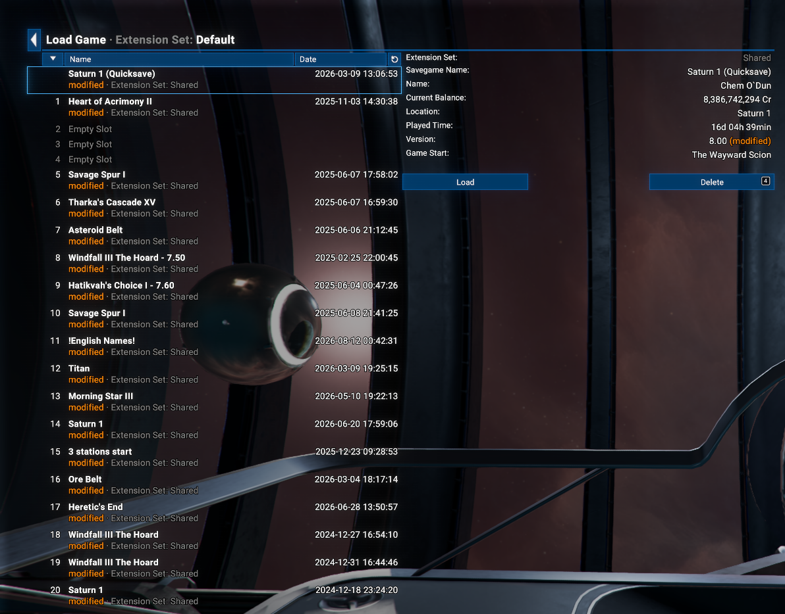

#### A Set that keeps its own savegames

On the first start under a new Set there are no saves of its own yet, so Continue falls back to a shared quicksave or autosave if there is one.

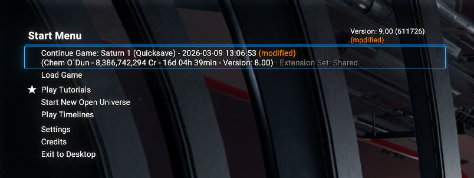

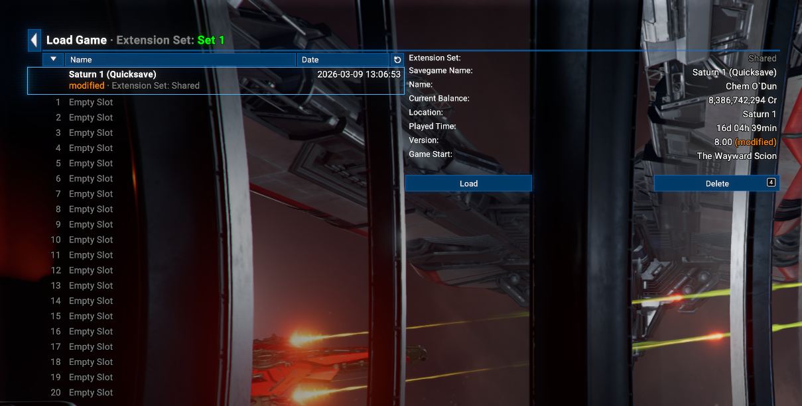

Once the Set has savegames of its own, those are what it lists.

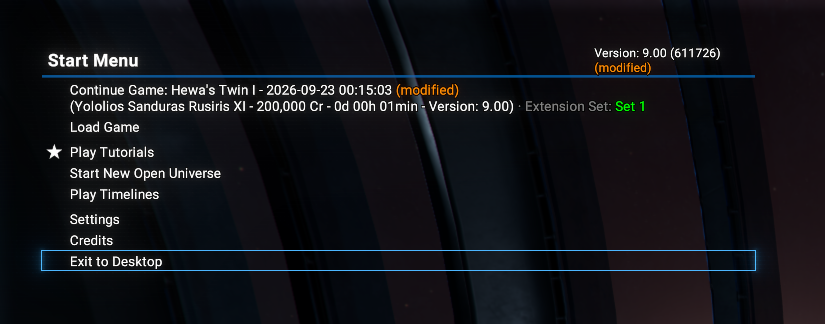

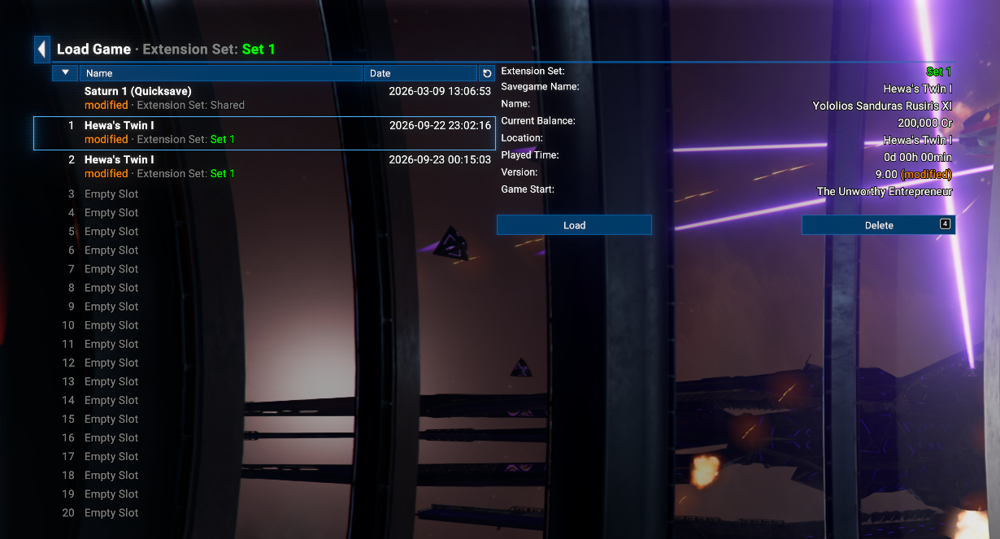

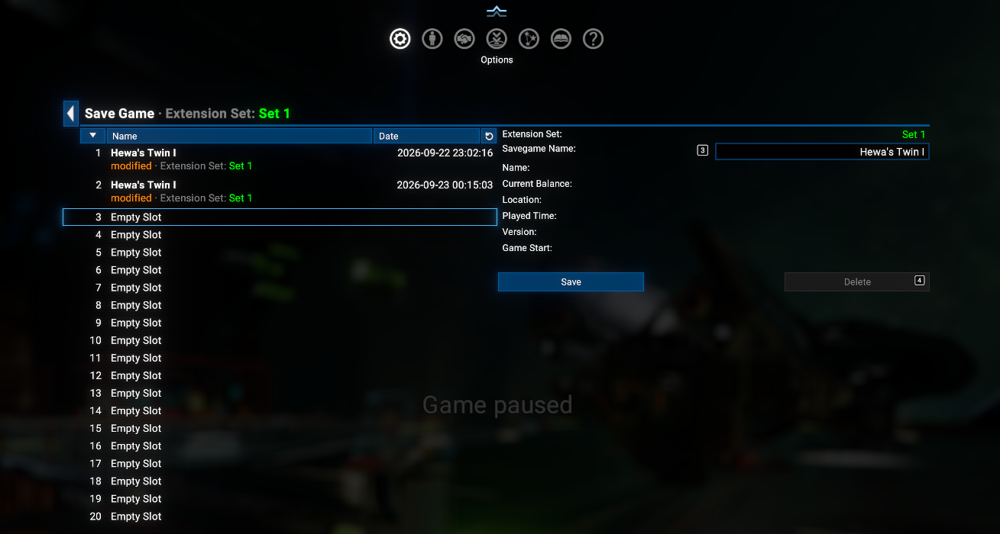

#### How the saves look in the save folder

A Set's savegames are ordinary save files. The only difference is the Set's five-digit id in front of the name.

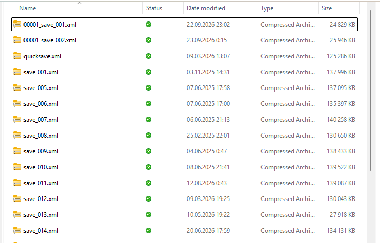

### Settings of the mod itself

The title row of the mod's block carries a **...** button, in the same column where every extension row keeps its own. It opens the mod's settings page, and the back arrow returns to the extension list. The page is reachable whether the feature is switched on or off.

- **Enabled**: the master switch for the whole feature. Off, the mod does nothing at all: no Set is applied, no savegames are kept apart, and the extension list below is an ordinary one. Every Set, the active-Set record and the per-Set savegames stay exactly where they are, so switching it back on picks up where it left off.
- **Debug mode**: how much the mod writes to the game log. **None** is the normal setting and still reports errors; **Debug** adds what the mod does on every action; **Trace** adds every store read and write, every button and every page build. Use the last two only while troubleshooting, then set it back.
- Under those, for reference: the store the Sets are kept in, how many Sets are saved, the savegame prefix the active Set writes, and whether a restart is already pending.

## Limitations

- **A Set only takes effect after a restart.** There is no way to reload extensions in a running X4, so applying a Set always means exiting and starting the game again.
- **This mod and the extensions it requires are always kept enabled** in every Set - *UI Extensions and HUD* and *Print Extension List* - and their buttons stay greyed out even while a Set is being edited. A Set that switched them off could not be switched away from.
- **Individual savegames cover manual saves only.** Quicksaves, autosaves and online saves are written by the engine under names no script sees, so they stay shared.
- **A Set's saves are hidden while another Set is active**, in the start menu as well as in game. That is the point of the feature, but it is the first thing that looks like a bug: if a save seems to be missing, check which Set is active.
- **The per-extension page** reached through the "..." button of an extension row still shows its Enabled row as clickable while the feature is on. The click does nothing; use Edit on a Set to change extension states.
- **One package covers both game versions.** The mod patches the options menu at runtime rather than replacing any game file, so 8.00 and 9.00 are served by the same build.
- **Set ids stop at 99999.** An id is never reused, so that is also the total number of Sets that can ever be created in one installation.

## Credits

- **Author**: Chem O`Dun, on [Nexus Mods](https://www.nexusmods.com/profile/ChemODun/mods?gameId=2659) and [Steam Workshop](https://steamcommunity.com/id/chemodun/myworkshopfiles/?appid=392160)
- *"X4: Foundations"* is a trademark of [Egosoft](https://www.egosoft.com).

## Acknowledgements

- [EGOSOFT](https://www.egosoft.com) - for the X series.
- [kuertee](https://next.nexusmods.com/profile/kuertee?gameId=2659) - for *UI Extensions and HUD*, which this mod builds its page on.

## Changelog

### [1.00] - 2026-09-??

- **Added**
  - Initial release.
